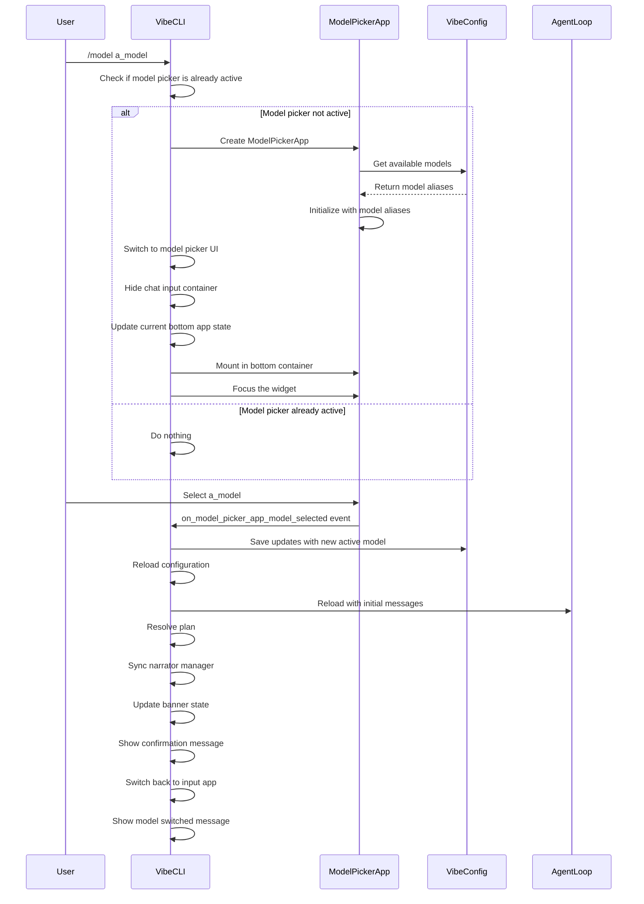
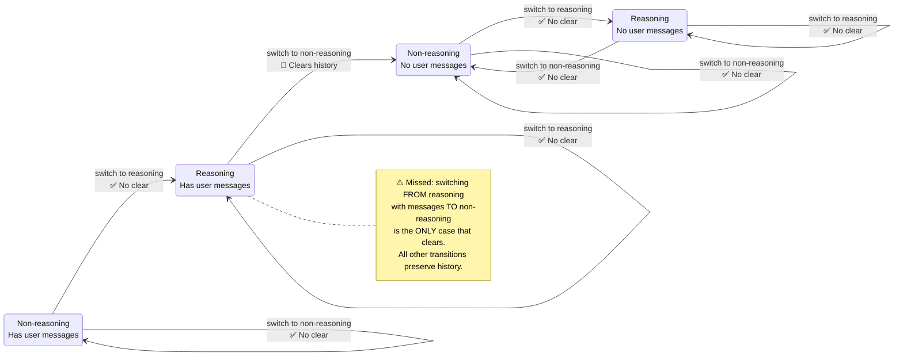

# Mistral Vibe Stuff

## Vibe CLI `/model` command flow

Here's an explanation of what happens when you invoke the `/model` command in the Vibe CLI interface:



### Workflow Explanation:

1. **User Invokes Command**:
   - The user types `/model a_model` in the Vibe CLI interface
   - This triggers the `_switch_to_model_picker_app` method

2. **Model Picker Initialization**:
   - The CLI checks if the model picker is already active
   - If not, it creates a new `ModelPickerApp` instance
   - The model picker gets the list of available models from the configuration
   - The model picker initializes with the available models and current selection

3. **UI Switching**:
   - The chat input container is hidden
   - The current bottom app state is updated to ModelPicker
   - The model picker is mounted in the bottom container
   - The model picker widget is focused

4. **Model Selection**:
   - The user selects a model from the picker
   - This triggers the `on_model_picker_app_model_selected` event handler

5. **Configuration Update**:
   - The new model is saved in the configuration
   - The configuration is reloaded
   - The agent loop is reloaded with initial messages
   - The plan is resolved
   - The narrator manager is synced
   - The banner state is updated

6. **UI Update**:
   - A confirmation message is shown
   - The UI switches back to the input app
   - A message confirming the model switch is displayed

This workflow shows the complete process from when you type the `/model` command until the UI updates to reflect the new model selection. The actual model switching happens through the configuration system, which then triggers the necessary UI updates and agent loop reloads.

## Mistral Vibe CLI -- Switching between model/thinking profiles



## Recap: Model/Thinking Switch Cases

### The Two Handlers

Both use **identical logic** to clear history:

```python
# on_model_picker_app_model_selected (lines 832-845)
if (current_model.thinking != "off" and new_model.thinking == "off" and len(self.agent_loop.messages) > 1):
    await self._clear_history()
    await self._mount_and_scroll(WarningMessage("History cleared: selected model doesn't support reasoning"))

# on_thinking_picker_app_thinking_selected (lines 854-867)
if (current_thinking != "off" and new_thinking == "off" and len(self.agent_loop.messages) > 1):
    await self._clear_history()
    await self._mount_and_scroll(WarningMessage("History cleared: reasoning disabled"))
```

**Key**: Both only clear history on **R+ → NR∅** (Reasoning+messages → Non-reasoning). All other 7 cases preserve history by default.

---

### 8 Cases Matrix

| #    | Transition   | on_model_picker            | on_thinking_picker           | Test                                                         |
| ---- | ------------ | -------------------------- | ---------------------------- | ------------------------------------------------------------ |
| 1    | **R+ → NR∅** | ✅ Clears                   | ✅ Clears                     | `test_switch_from_reasoning_to_non_reasoning_clears_history` + warning test |
| 2    | R∅ → NR∅     | ❌ No clear (len ≤ 1)       | ❌ No clear (len ≤ 1)         | `test_switch_from_reasoning_to_non_reasoning_with_no_history_does_not_clear` |
| 3    | NR+ → R+     | ❌ No clear (not downgrade) | N/A (picker only downgrades) | `test_switch_from_non_reasoning_to_reasoning_does_not_clear` |
| 4    | NR∅ → R∅     | ❌ No clear (not downgrade) | N/A                          | `test_switch_from_non_reasoning_to_reasoning_with_no_history_does_not_clear` |
| 5    | R+ → R+      | ❌ No clear (not downgrade) | ❌ No clear (not downgrade)   | `test_switch_between_reasoning_models_does_not_clear`        |
| 6    | R∅ → R∅      | ❌ No clear (not downgrade) | ❌ No clear (not downgrade)   | `test_switch_between_reasoning_models_with_no_history_does_not_clear` |
| 7    | NR+ → NR+    | ❌ No clear (not downgrade) | N/A                          | `test_switch_between_non_reasoning_models_does_not_clear`    |
| 8    | NR∅ → NR∅    | ❌ No clear (not downgrade) | N/A                          | `test_switch_between_non_reasoning_models_with_no_history_does_not_clear` |

**Legend**: R = Reasoning, NR = Non-reasoning, + = has messages, ∅ = only system message

---

### Test Coverage Summary

| Handler                                    | Tests   | Coverage                                 |
| ------------------------------------------ | ------- | ---------------------------------------- |
| `on_model_picker_app_model_selected`       | 9 tests | **All 8 cases covered**                  |
| `on_thinking_picker_app_thinking_selected` | 9 tests | **All 8 cases covered** (via same logic) |

**Note**: The thinking picker only handles downgrades (R → NR). Upgrades (NR → R) are implicit and correctly preserve history.
